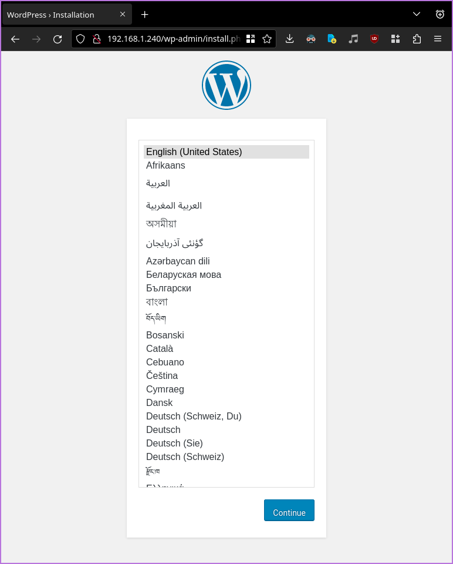

# Provisioning a cluster of k8s nodes to an on-premise KVM hypervisor and deploying wordpress to it

- [Provisioning a cluster of k8s nodes to an on-premise KVM hypervisor and deploying wordpress to it](#provisioning-a-cluster-of-k8s-nodes-to-an-on-premise-kvm-hypervisor-and-deploying-wordpress-to-it)
    - [Prerequisites](#prerequisites)
        - [Disclaimer](#disclaimer)
    - [Creating the cluster](#creating-the-cluster)
        - [Setup a network bridge for KVM](#setup-a-network-bridge-for-kvm)
        - [Generate an SSH key to use with the cluster](#generate-an-ssh-key-to-use-with-the-cluster)
        - [Create VMs](#create-vms)
    - [Installing Kubernetes](#installing-kubernetes)
    - [Configuring MetalLB Load Balancer](#configuring-metallb-load-balancer)
    - [Deploying wordpress+mysql app](#deploying-wordpressmysql-app)
- [References](#references)

## Prerequisites

A linux host with :

- system requirements
    - recommended:
        - 12GB RAM
        - 6 CPU cores
        - 50GB disk space
    - minimum:
        - 6GB RAM
        - 4 CPU cores
        - 30GB disk space
- [libvirt](https://libvirt.org/)
- [qemu-kvm](https://www.qemu.org/)
- [nmcli](https://manpages.ubuntu.com/manpages/lunar/man1/nmcli.1.html)
- [Hashicorp Vagrant](https://www.vagrantup.com/)
- [Ansible](https://www.ansible.com/)

### Disclaimer

This setup was created and tested on Fedora 37, but should work on any linux
distro. The libvirt bridge network requires root privileges to create and use,
which forces us to use vagrant as root, which in turn forces running ansible as
root. This is not ideal, but it's the only way compatible with Fedora's libvirt
defaults, other distros may allow non-privileged users to use all libvirt
features in a local (per-user) scope so your mileage may vary, but modifying the
repo to work with another user is easy, the only thing to change is
`HOST_HOME_PATH = "/root"` in the Vagrantfile and `/root` to `$HOME` in the
README.md instructions.

## Creating the cluster

First connect to the host machine and clone this repo on it, the rest of the
document assumes you're in the root of the repo on the host server.

### Setup a network bridge for KVM

1. Show active interfaces and take note of the one you want to bridge

    ```console
    $ nmcli con show --active
    NAME                UUID                                  TYPE      DEVICE
    Wired1              3e1e1b5d-1b0b-4b0e-9e0a-1b0b4b0e9e0a  ethernet  enp2s0
    CENSORED            45b17347-1a0c-4b0e-8d0f-4b0e8d0f4b0e  wifi      wlo1
    ```

1. Create a bridge interface

    ```console
    $ nmcli con add ifname br0 type bridge con-name br0
    Connection 'br0' (f5075153-2aef-4a61-9be7-887021b54c8e) successfully added.
    ```

1. Link the bridge interface to real interface (enp2s0 in this example)

    ```console
    $ nmcli con add type bridge-slave ifname enp2s0 master br0
    Connection 'bridge-slave-enp2s0' (b9b264d8-59c8-4200-85a6-bc6e221c392d)
    successfully added.
    ```

1. Bring up the new bridge, this'll take down the original interface

    ```console
    $ nmcli con up br0 && nmcli con up bridge-slave-enp2s0
    Connection successfully activated (master waiting for slaves) (D-Bus active
    path: /org/freedesktop/NetworkManager/ActiveConnection/10)
    Connection successfully activated (D-Bus active path: /org/freedesktop/Netwo
    rkManager/ActiveConnection/11)
    ```

1. Create a new libvirt network for the bridge

    ```console
    $ cat <<EOF >bridge.xml
    <network>
        <name>host-bridge</name>
        <forward mode="bridge"/>
        <bridge name="br0"/>
    </network>
    EOF

    $ sudo virsh net-define bridge.xml   # okay to delete after
    Network host-bridge defined from bridge.xml
    ```

1. Start the network

    ```console
    $ sudo virsh net-start host-bridge
    Network host-bridge started

    $ sudo virsh net-autostart host-bridge
    Network host-bridge marked as autostarted
    ```

1. Verify libvirt networks

    ```console
    $ sudo virsh net-list --all
    Name          State    Autostart   Persistent
    ------------------------------------------------
    default       active   yes         yes
    host-bridge   active   yes         yes
    ```

### Generate an SSH key to use with the cluster

```bash
sudo ssh-keygen -t ed25519 -f /root/.ssh/k8s_ed25519 -C "baremetal-k8s"
```

### Create VMs

1. Identify a block of unused IP addresses on the host network to allocate to
the cluster and edit `NETWORK_PREFIX` in the [`Vagrantfile`](./Vagrantfile) to
use it.

1. Read, validate and edit the [`Vagrantfile`](./Vagrantfile) to your needs

    you might want to change the following:

    - WORKER_COUNT: the number of worker nodes to create (total node count)
    = 1 master + WORKER_COUNT
    - cpu count & memory size per node

        ```ruby
        libvirt.cpus = 2
        libvirt.memory = 4096
        ```

        The default config provisions 3 nodes, requiring a total of 6 CPU cores
        and 12GB of RAM. Setting the RAM to 2GB per node works but complex
        deployments on k8s will run out of memory.

1. Make sure you're in the root of the repo and run the Vagrantfile

    ```console
    $ sudo vagrant up
    ...           
    ==> worker-2: Machine booted and ready!
    ==> worker-2: Setting hostname... 
    ==> worker-1: Machine booted and ready!
    ==> worker-1: Setting hostname... 
    ==> master: Machine booted and ready!
    ==> master: Setting hostname... 
    ==> worker-2: Configuring and enabling network interfaces... 
    ==> worker-1: Configuring and enabling network interfaces... 
    ==> master: Configuring and enabling network interfaces... 
    ==> worker-2: Running provisioner: shell... 
        worker-2: Running: inline script 
        worker-2: SSH key provisioning.
    ==> worker-1: Running provisioner: shell... 
    ==> master: Running provisioner: shell... 
        worker-1: Running: inline script 
        worker-1: SSH key provisioning.
        master: Running: inline script                  
        master: SSH key provisioning.
    ```

1. Verify VMs are running

    ```console
    $ sudo virsh list --all
     Id   Name                     State
    -----------------------------------------
     1    baremetal-k8s_master     running
     2    baremetal-k8s_worker-1   running
     3    baremetal-k8s_worker-2   running
     ...
    ```

1. Verify `master` is live on `br0`

    ```console
    $ ping 192.168.1.170
    PING 192.168.1.170 (192.168.1.170) 56(84) bytes of data.
    64 bytes from 192.168.1.170: icmp_seq=1 ttl=64 time=0.285 ms
    64 bytes from 192.168.1.170: icmp_seq=2 ttl=64 time=0.241 ms
    64 bytes from 192.168.1.170: icmp_seq=3 ttl=64 time=0.243 ms
    64 bytes from 192.168.1.170: icmp_seq=4 ttl=64 time=0.568 ms
    64 bytes from 192.168.1.170: icmp_seq=5 ttl=64 time=0.174 ms
    ^C
    --- 192.168.1.170 ping statistics ---
    5 packets transmitted, 5 received, 0% packet loss, time 4093ms
    rtt min/avg/max/mdev = 0.174/0.302/0.568/0.137 ms
    ```

The VMs are now ready to be provisioned with kubernetes. They can be brought up
and down at any time with `sudo vagrant up` and `sudo vagrant halt`, and deleted
with `sudo vagrant destroy`.

## Installing Kubernetes

1. Validate Ansible's SSH connection

    ```console
    $ sudo ansible -i hosts all -m ping
    worker-1.kube.local | SUCCESS => {
        "ansible_facts": {
            "discovered_interpreter_python": "/usr/bin/python3"
        },
        "changed": false,
        "ping": "pong"
    }
    master.kube.local | SUCCESS => {
        "ansible_facts": {
            "discovered_interpreter_python": "/usr/bin/python3"
        },
        "changed": false,
        "ping": "pong"
    }
    worker-2.kube.local | SUCCESS => {
        "ansible_facts": {
            "discovered_interpreter_python": "/usr/bin/python3"
        },
        "changed": false,
        "ping": "pong"
    }
    ```

1. Install Kubernetes on the cluster

    ```console
    $ sudo ansible-playbook -i hosts install-kubernetes.yml
    ...
    ```

1. Connect your local kubectl to the cluster

    NOTE: this will move your local `~/.kube/config` to `~/.kube/config.bak`

   ```console
   $ sudo vagrant ssh master -c 'sudo cat /home/kube/.kube/config' > ./config
   $ cp ~/.kube/config ~/.kube/config.bak
   $ cp ./config ~/.kube/config
   ```

1. Verify the cluster is up

    ```console
    $ kubectl get nodes
    NAME                  STATUS   ROLES           AGE     VERSION
    master.kube.local     Ready    control-plane   3m30s   v1.27.2
    worker-1.kube.local   Ready    <none>          60s     v1.27.2
    worker-2.kube.local   Ready    <none>          60s     v1.27.2
    ```

1. Verify the cluster is healthy

    ```console
    $ kubectl get componentstatus   # deprecated but good enough
    Warning: v1 ComponentStatus is deprecated in v1.19+
    NAME                 STATUS    MESSAGE                         ERROR
    scheduler            Healthy   ok                              
    controller-manager   Healthy   ok                              
    etcd-0               Healthy   {"health":"true","reason":""}  
    ```

## Configuring MetalLB Load Balancer

1. Identify another block of unused IP addresses on the host network to allocate
to the load balancer, and edit
[`k8s/metallb/metallb.yml`](./k8s/metallb/metallb.yml).spec.addresses to use
it.

    NOTE: this IP pool definition uses Layer 2 mode instead of BGP, which isn't
    the most performant production configuration, but it's the one suitable for
    homelab environments where the router isn't under your control.

1. Apply the MetalLB configuration

    ```console
    $ kubectl apply -f k8s/metallb
    ipaddresspool.metallb.io/first-pool created
    l2advertisement.metallb.io/main created
    ```

## Deploying wordpress+mysql app

1. Create mysql secrets

   ```console
   $ cat<<EOF >k8s/wordpress/db-secret.yml
    apiVersion: v1
    kind: Secret
    metadata:
    name: db-secret
    data:
    #  MYSQL_USER: $(echo -n root | base64)
    #  MYSQL_PASSWORD: $(echo -n password | base64)
    MYSQL_ROOT_PASSWORD: $(echo -n strongandcomplicatedpassword | base64)
    EOF
    ```

1. Deploy application

   ```console
   $ kubectl apply -f k8s/wordpress && sleep 5 && kubectl get po 
   secret/db-secret unchanged
   persistentvolume/mysql-pv created
   persistentvolumeclaim/mysql-pv-claim created
   deployment.apps/wp-mysql created
   service/wp-mysql created
   persistentvolume/wp-pv created
   persistentvolumeclaim/wp-pv-claim created
   deployment.apps/wp-server created
   service/wp-server created
   NAME                         READY   STATUS    RESTARTS   AGE
   wp-mysql-744c886989-jcwvf    1/1     Running   0          5s
   wp-server-7c89f74666-wzskz   1/1     Running   0          5s
   ```

1. Get frontend service IP address

   ```console
   $ kubectl get svc wp-server 
   NAME        TYPE           CLUSTER-IP      EXTERNAL-IP     PORT(S)        AGE
   wp-server   LoadBalancer   10.103.95.149   192.168.1.240   80:31379/TCP   20s
   ```

    note that port `192.168.1.240:80` can be forwarded in the router to expose
    the service to the internet.

1. Visit the service at `http://<external-ip>:80` on your browser
    

# References

- [Configuring a Network Bridge - Red Hat Enterprise Linux](https://access.redhat.com/documentation/en-us/red_hat_enterprise_linux/8/html/configuring_and_managing_networking/configuring-a-network-bridge_configuring-and-managing-networking)
- [Install Kubeadm - Kubernetes Documentation](https://kubernetes.io/docs/setup/production-environment/tools/kubeadm/install-kubeadm/)
- [Create a Kubernetes Cluster with Kubeadm - Kubernetes Documentation](https://kubernetes.io/docs/setup/production-environment/tools/kubeadm/create-cluster-kubeadm/)
- [Container Runtimes - Kubernetes Documentation](https://kubernetes.io/docs/setup/production-environment/container-runtimes)
- [Configure Cgroup Driver - Kubernetes Documentation](https://kubernetes.io/docs/tasks/administer-cluster/kubeadm/configure-cgroup-driver/)
- [Calico Quickstart - Tigera Documentation](https://docs.tigera.io/calico/latest/getting-started/kubernetes/quickstart)
- [Weave Net - Kubernetes Add-on - Weave Documentation](https://www.weave.works/docs/net/latest/kubernetes/kube-addon/)
- [Metallb Advanced Layer 2 Configuration - Metallb Documentation](https://metallb.universe.tf/configuration/_advanced_l2_configuration/)
- [Metallb Usage - Metallb Documentation](https://metallb.universe.tf/usage/)
- [my solutions for the KodeKloud K8s labs](https://github.com/janw4ld/k8s-labs)
